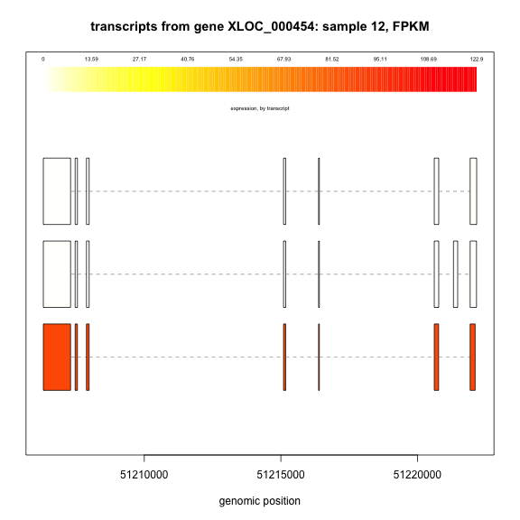
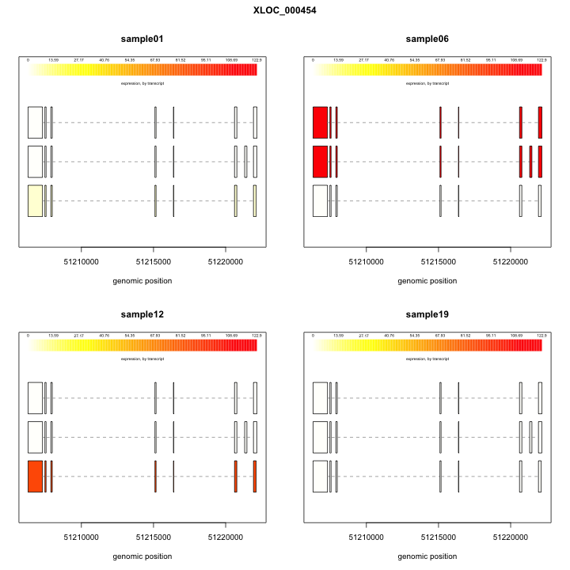
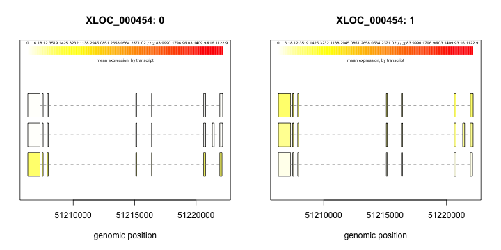
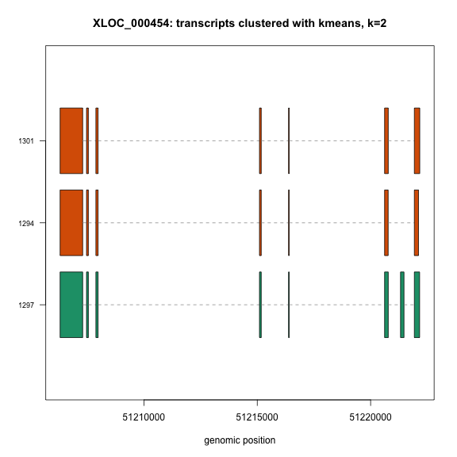

# Introduction
Ballgown is a software package designed to facilitate flexible differential expression analysis of RNA-seq data. 

Before using the Ballgown R package, a few preprocessing steps are necessary:
* RNA-seq reads should be aligned to a reference genome. Any junction-aware aligner is appropriate.
* A transcriptome should be assembled, or a reference transcriptome should be downloaded. Any assembler or download that produces a GTF file denoting the transcriptome's structure is appropriate.
* Expression for the features in the transcriptome should be estimated. We provide software called _Tablemaker_ that does this estimation. Tablemaker calls _Cufflinks_ version 2.1.1 (<a href="http://dx.doi.org/10.1038/nbt.1621">Trapnell et al. (2010)</a>) to estimate transcript-level FPKMs, and provides several alternative expression measurements (e.g. average per-base coverage, number of mapped reads, etc.) for other features. Expression is estimated for each transcript, exon, and intron (junction) in the assembly. 

The Ballgown package provides functions to organize, visualize, and analyze the expression measurements for your transcriptome assembly. 

# Installation
Ballgown is [available via Bioconductor](http://bioconductor.org/packages/devel/bioc/html/ballgown.html).  

To install, start R and run:

```r
source("http://bioconductor.org/biocLite.R")
biocLite("ballgown")
```

Please note that in order to use Ballgown, you will need to be running the ["devel" version of Bioconductor](http://www.bioconductor.org/developers/how-to/useDevel/) until the next release (~October 2014). You can switch to the devel version of Bioconductor and update your current packages as follows:

```r
library(BiocInstaller)
useDevel()
biocLite("ballgown")
## select "all" when prompted to update packages
```
<!--- Currently only the devel version is available, and it can be installed from GitHub: 

```R
install.packages('devtools') #if needed
devtools::install_github('ballgown', 'alyssafrazee')
```
-->

#### "alpha" version
`ballgown` changed significantly in July 2014. For backwards compatibility with code written before July 2014, we've saved the original version of Ballgown in the `alpha` branch of this repository. You can install this version from GitHub:

```r
install.packages("devtools") #if needed
devtools::install_github('ballgown', 'alyssafrazee', ref='alpha')
```

# Running Tablemaker
Users need to run _Tablemaker_ to organize assembly output into a format that Ballgown can load. Tablemaker can be downloaded from figshare:

* [OSX binary](http://figshare.com/articles/Tablemaker_OS_X_Binary/1053136)
* [Linux binary](http://figshare.com/articles/Tablemaker_Linux_Binary/1053137)

Tablemaker can also be built from source from [this repository](https://github.com/alyssafrazee/tablemaker) by following [Cufflinks' instructions](http://cufflinks.cbcb.umd.edu/tutorial.html). 

Tablemaker needs to be run on each RNA-seq sample in your experiment.  It requires one transcripome assembly, in [GTF format](http://www.ensembl.org/info/website/upload/gff.html), and read alignments for each sample, in BAM format. From the command line, _Tablemaker_ is run as follows:

`tablemaker -p 4 -q -W -G merged.gtf -o sample01_output read_alignments.bam`

where:
* `-p` denotes how many threads to use (the program can take a few hours to run, but can be parallelized)
* The `-q` can be removed for more verbose output messages  
* `-W` and `-G merged.gtf` are required.  The `-W` tells the program to run in tablemaker mode (rather than Cufflinks mode), and the `-G` argument points to the assembly GTF file, which gives the assembled transcripts' structures. For Cufflinks users, often this is the `merged.gtf` output from Cuffmerge.
* The argument to `-o` is the desired output directory for the sample (each sample should have its own output directory)
* The read alignment file is the last argument.  If reads were aligned with TopHat, this is usually some variant of `accepted_hits.bam`

The output is 5 files, written to the specified output directory:

* `e_data.ctab`: exon-level expression measurements.  One row per exon.  Columns are `e_id` (numeric exon id), `chr`, `strand`, `start`, `end` (genomic location of the exon), and the following expression measurements for each sample:
    * `rcount`:  reads overlapping the exon 
    * `ucount`: uniquely mapped reads overlapping the exon 
    * `mrcount`: multi-map-corrected number of reads overlapping the exon
    * `cov` average per-base read coverage 
    * `cov_sd`: standard deviation of per-base read coverage
    * `mcov`: multi-map-corrected average per-base read coverage
    * `mcov_sd`: standard deviation of multi-map-corrected per-base coverage
* `i_data.ctab`: intron- (i.e., junction-) level expression measurements.  One row per intron.  Columns are `i_id` (numeric intron id), `chr`, `strand`, `start`, `end` (genomic location of the intron), and the following expression measurements for each sample: 
    * `rcount`: number of reads supporting the intron
    * `ucount`: number of uniquely mapped reads supporting the intron
    * `mrcount`: multi-map-corrected number of reads supporting the intron
* `t_data.ctab`: transcript-level expression measurements.  One row per transcript.  Columns are:
    * `t_id`: numeric transcript id
    * `chr`, `strand`, `start`, `end`: genomic location of the transcript
    * `t_name`: Cufflinks-generated transcript id
    * `num_exons`: number of exons comprising the transcript
    * `length`: transcript length, including both exons and introns
    * `gene_id`: gene the transcript belongs to
    * `gene_name`: HUGO gene name for the transcript, if known
    * `cov`: per-base coverage for the transcript (available for each sample)
    * `FPKM`: Cufflinks-estimated FPKM for the transcript (available for each sample)
* `e2t.ctab`: table with two columns, `e_id` and `t_id`, denoting which exons belong to which transcripts.  These ids match the ids in the `e_data` and `t_data` tables.
* `i2t.ctab`: table with two columns, `i_id` and `t_id`, denoting which introns belong to which transcripts.  These ids match the ids in the `i_data` and `t_data` tables.


# Loading data into R
At this point, _Tablemaker_ should have been run on all samples in the experiment. For this example, assume each sample's _Tablemaker_ output directory is a subfolder of the same root directory. The Ballgown package's `extdata` folder provides an example of such a directory, where the folder structure looks like:

```
extdata/
    sample01/
        e2t.ctab
        e_data.ctab
        i2t.ctab
        i_data.ctab
        t_data.ctab
    sample02/
        e2t.ctab
        e_data.ctab
        i2t.ctab
        i_data.ctab
        t_data.ctab
    ...
    sample20/
        e2t.ctab
        e_data.ctab
        i2t.ctab
        i_data.ctab
        t_data.ctab
```

Data is loaded using the `ballgown` function:


```r
library(ballgown)
data_directory = system.file('extdata', package='ballgown')
bg = ballgown(dataDir=data_directory, samplePattern='sample', meas='all')
```

```
## Thu Jul 10 15:40:27 2014
## Thu Jul 10 15:40:27 2014: Reading linking tables
## Thu Jul 10 15:40:27 2014: Reading intron data files
## Thu Jul 10 15:40:27 2014: Merging intron data
## Thu Jul 10 15:40:28 2014: Reading exon data files
## Thu Jul 10 15:40:28 2014: Merging exon data
## Thu Jul 10 15:40:28 2014: Reading transcript data files
## Thu Jul 10 15:40:28 2014: Merging transcript data
## Wrapping up the results
## Thu Jul 10 15:40:28 2014
```

```r
bg
```

```
## ballgown instance with 100 assembled transcripts and 20 samples
```

`bg` is an object of class `ballgown`.

For large experiments, meaning experiments with many samples or experiments run on large genomes, loading the data might require a lot of time and memory. In these cases, it's often useful to do the data loading as a non-interactive batch job and to save the result as an R object (e.g. an `rda` file). The R object is compressed and is usually only a few Gb on disk, even for large experiments, and can usually be handled interactively with a reasonable amount of memory. It is also possible to load only a subset of all the expression measurements by changing the `meas` argument to the `ballgown` function. For example, to only load transcript-level FPKMs, set `meas = 'FPKM'` and to load average coverage values and read counts, set `meas=c('cov', 'rcount').`

See `?ballgown` for detailed information on creating Ballgown objects.

# Accessing assembly data
A `ballgown` object has six slots: `structure`, `expr`, `indexes`, `dirs`, `mergedDate`, and `meas`. 

#### structure
The `structure` slot depends heavily on the `GenomicRanges` Bioconductor package (<a href="http://dx.doi.org/10.1371/journal.pcbi.1003118">Lawrence et al. (2013)</a>). The slot specifies the structure, i.e., genomic locations and relationships between exons, introns, and transcripts, of the transcriptome assembly.  It is convenient to represent exons and introns as intervals and to represent transcripts as a set of intervals (exons), so assembled exons and introns are available as `GRanges` objects, and the assembled transcripts are available as a `GRangesList` object.  This means that useful range operations, such as `findOverlaps` and `reduce`, are readily available for assembled features. 

Exon, intron, and transcript structures are easily extracted from the main `ballgown` object:


```r
structure(bg)$exon
```

```
## GRanges with 633 ranges and 2 metadata columns:
##         seqnames               ranges strand   |        id transcripts
##            <Rle>            <IRanges>  <Rle>   | <integer> <character>
##     [1]       18 [24412069, 24412331]      *   |        12          10
##     [2]       22 [17308271, 17308950]      +   |        55          25
##     [3]       22 [17309432, 17310226]      +   |        56          25
##     [4]       22 [18121428, 18121652]      +   |        88          35
##     [5]       22 [18138428, 18138598]      +   |        89          35
##     ...      ...                  ...    ... ...       ...         ...
##   [629]       22 [51221929, 51222113]      -   |      3777        1294
##   [630]       22 [51221319, 51221473]      -   |      3782        1297
##   [631]       22 [51221929, 51222162]      -   |      3783        1297
##   [632]       22 [51221929, 51222168]      -   |      3784        1301
##   [633]        6 [31248149, 31248334]      *   |      3794        1312
##   ---
##   seqlengths:
##    18 22  6
##    NA NA NA
```

```r
structure(bg)$intron
```

```
## GRanges with 536 ranges and 2 metadata columns:
##         seqnames               ranges strand   |        id
##            <Rle>            <IRanges>  <Rle>   | <integer>
##     [1]       22 [17308951, 17309431]      +   |        33
##     [2]       22 [18121653, 18138427]      +   |        57
##     [3]       22 [18138599, 18185008]      +   |        58
##     [4]       22 [18185153, 18209442]      +   |        59
##     [5]       22 [18385514, 18387397]      -   |        72
##     ...      ...                  ...    ... ...       ...
##   [532]       22 [51216410, 51220615]      -   |      2750
##   [533]       22 [51220776, 51221928]      -   |      2756
##   [534]       22 [51220780, 51221318]      -   |      2757
##   [535]       22 [51221474, 51221928]      -   |      2758
##   [536]       22 [51220780, 51221928]      -   |      2759
##                 transcripts
##                 <character>
##     [1]                  25
##     [2]                  35
##     [3]                  35
##     [4]                  35
##     [5]                  41
##     ...                 ...
##   [532] c(1294, 1297, 1301)
##   [533]                1294
##   [534]                1297
##   [535]                1297
##   [536]                1301
##   ---
##   seqlengths:
##    22
##    NA
```

```r
structure(bg)$trans
```

```
## GRangesList of length 100:
## $10 
## GRanges with 1 range and 2 metadata columns:
##       seqnames               ranges strand |        id transcripts
##          <Rle>            <IRanges>  <Rle> | <integer> <character>
##   [1]       18 [24412069, 24412331]      * |        12          10
## 
## $25 
## GRanges with 2 ranges and 2 metadata columns:
##       seqnames               ranges strand | id transcripts
##   [1]       22 [17308271, 17308950]      + | 55          25
##   [2]       22 [17309432, 17310226]      + | 56          25
## 
## $35 
## GRanges with 4 ranges and 2 metadata columns:
##       seqnames               ranges strand | id transcripts
##   [1]       22 [18121428, 18121652]      + | 88          35
##   [2]       22 [18138428, 18138598]      + | 89          35
##   [3]       22 [18185009, 18185152]      + | 90          35
##   [4]       22 [18209443, 18212080]      + | 91          35
## 
## ...
## <97 more elements>
## ---
## seqlengths:
##  18 22  6
##  NA NA NA
```
#### expr
The `expr` slot is a list that contains tables of expression data for the genomic features.  These tables are very similar to the `*_data.ctab` _Tablemaker_ output files. Ballgown implements the following syntax to access components of the `expr` slot:

```R
*expr(ballgown_object_name, <EXPRESSION_MEASUREMENT>)
``` 

where `*` is either e for exon, i for intron, t for transcript, or g for gene, and `<EXPRESSION MEASUREMENT>` is an expression-measurement column name from the appropriate `.ctab` file.  Gene-level measurements are calculated by aggregating the transcript-level measurements for that gene.  All of the following are valid ways to extract expression data from the `bg` ballgown object:


```r
transcript_fpkm = texpr(bg, 'FPKM')
transcript_cov = texpr(bg, 'cov')
whole_tx_table = texpr(bg, 'all')
exon_mcov = eexpr(bg, 'mcov')
junction_rcount = iexpr(bg)
whole_intron_table = iexpr(bg, 'all')
gene_expression = gexpr(bg)
```
Calculating the gene-level expression measurements can be slow for large experiments.

The `*expr` functions return matrices unless `meas = 'all'`, in which case some additional feature metadata is returned and the result is a `data.frame`.

#### indexes
The `indexes` slot of a ballgown object connects the pieces of the assembly and provides other experimental information. `indexes(bg)` is a list with several components that can be extracted with the `$` operator.

Perhaps most importantly, there is a component called `pData` that should hold a data frame of phenotype information for the samples in the experiment. This must be created manually.  It is **very important** that the rows of pData are in the correct order. Each row corresponds to a sample, and the rows of pData should be ordered the same as the tables in the `expr` slot. You can check that order by running `sampleNames(bg)`. The `pData` component can be added during construction (you can pass a data frame to the `ballgown` function, which does its best to make sure the rows are in the right order), or you can add it later:


```r
pData(bg) = data.frame(id=sampleNames(bg), group=rep(c(1,0), each=10))
```

The other components of `indexes` are the `e2t` and `i2t` tables described in the _Tablemaker_ section, as well as a `t2g` table denoting which transcripts belong to which genes.  There is also a `bamfiles` component, designed to hold paths to the read alignment files for each sample. The `bamfiles` component isn't currently used by any ballgown functions, but it could come in handy for users of `RSamtools` or similar packages.  Here are some examples of how to extract `indexes` components from ballgown objects:


```r
exon_transcript_table = indexes(bg)$e2t
transcript_gene_table = indexes(bg)$t2g
head(transcript_gene_table)
```

```
##   t_id        g_id
## 1   10 XLOC_000010
## 2   25 XLOC_000014
## 3   35 XLOC_000017
## 4   41 XLOC_000246
## 5   45 XLOC_000019
## 6   67 XLOC_000255
```

```r
phenotype_table = pData(bg)
```

#### other slots

The `dirs` slot gives full filepaths to _Tablemaker_ output:


```r
head(bg@dirs)
```

```
##                                                                                   sample01 
## "/Library/Frameworks/R.framework/Versions/3.1/Resources/library/ballgown/extdata/sample01" 
##                                                                                   sample02 
## "/Library/Frameworks/R.framework/Versions/3.1/Resources/library/ballgown/extdata/sample02" 
##                                                                                   sample03 
## "/Library/Frameworks/R.framework/Versions/3.1/Resources/library/ballgown/extdata/sample03" 
##                                                                                   sample04 
## "/Library/Frameworks/R.framework/Versions/3.1/Resources/library/ballgown/extdata/sample04" 
##                                                                                   sample05 
## "/Library/Frameworks/R.framework/Versions/3.1/Resources/library/ballgown/extdata/sample05" 
##                                                                                   sample06 
## "/Library/Frameworks/R.framework/Versions/3.1/Resources/library/ballgown/extdata/sample06"
```

The `mergedDate` slot indicates when the `ballgown` object was created:


```r
bg@mergedDate
```

```
## [1] "Thu Jul 10 15:40:28 2014"
```

And the `meas` slot gives the expression measurements present in the object:

```r
bg@meas
```

```
## [1] "all"
```

# Plotting transcript structures

Visualization of the assembled transcripts is done with the `plotTranscripts` function. Transcripts or exons can be colored by expression level. This plot colors transcripts by expression level:


```r
plotTranscripts(gene='XLOC_000454', gown=bg, samples='sample12', meas='FPKM', colorby='transcript', main='transcripts from gene XLOC_000454: sample 12, FPKM')
```

 

It is also possible to plot several samples at once:


```r
plotTranscripts('XLOC_000454', bg, samples=c('sample01', 'sample06', 'sample12', 'sample19'), meas='FPKM', colorby='transcript')
```

 

You can also make side-by-side plots comparing mean abundances between groups (here, 0 and 1):


```r
plotMeans('XLOC_000454', bg, groupvar='group', meas='FPKM', colorby='transcript')
```

 

# Differential expression analysis

Ballgown provides a wide selection of simple, fast statistical methods for testing whether transcripts are differentially expressed between experimental conditions or across a continuous covariate (such as time). 

The default statistical test in ballgown is a parametric F-test comparing nested linear models; details are available in the Ballgown manuscript (<a href="http://biorxiv.org/content/early/2014/03/30/003665">Frazee et al. (2014)</a>). These models are conceptually simialar to the models used by <a href="">Smyth (2005)</a> in the `limma` package. In `limma`, more sophisticated empirical Bayes shrinkage methods are used, and generally a single linear model is fit per feature instead of doing a nested model comparison, but the flavor is similar (and in fact, `limma` can easily be run on any of the data matrices in a `ballgown` object).

Ballgown's statistical models are implemented with the `stattest` function. Two models are fit to each feature, using expression as the outcome: one including the covariate of interest (e.g., case/control status or time) and one not including that covariate. An F statistic and p-value are calculated using the fits of the two models. A significant p-value means the model including the covariate of interest fits significantly better than the model without that covariate, indicating differential expression. We adjust for multiple testing by reporting q-values (<a href="http://dx.doi.org/10.1073/pnas.1530509100">Storey & Tibshirani (2003)</a>) for each transcript in addition to p-values: reporting features with, say, q < 0.05 means the false discovery rate should be controlled at about 5%. 

`stattest` automatically handles two-group (e.g. case/control) comparisons, multi-group comparisons (e.g. comparison of several tissue types), and "timecourse" comparisons (with the scare quotes meaning that these comparisons are also applicable to continuous covariates that aren't time). For two- and multi-group comparisons, a significant result indicates that the feature is differentially expressed in at least one of the groups. For timecourse comparisions, significant results mean the feature has an expression profile that varies significantly over time (i.e., values of the continuous covariate) as opposed to being flat over time. 

The example dataset `bg` contains two group labels, 0 and 1. We can test each transcript for differential expression with `stattest`:


```r
stat_results = stattest(bg, feature='transcript', meas='FPKM', covariate='group')
head(stat_results)
```

```
##      feature id    pval    qval
## 1 transcript 10 0.01382 0.10521
## 2 transcript 25 0.26774 0.79115
## 3 transcript 35 0.01085 0.08952
## 4 transcript 41 0.47108 0.90254
## 5 transcript 45 0.08403 0.48935
## 6 transcript 67 0.27317 0.79115
```
The result is a data frame containing the feature tested, feature ids, and corresponding p- and q-values. See `?stattest` for further usage details.

#### timecourse experiments
For timecourse experiments, a smooth curve is fit to time (or the continuous covariate) using [natural splines](http://en.wikipedia.org/wiki/Spline_interpolation). The model for expression including these spline terms is compared to a model without any spline terms for the F-test. The results indicate which features' expression levels change significantly over time. For our example, we can define a "time" covariate and then demonstrate a typical call to `stattest` for a timecourse experiment:


```r
pData(bg) = data.frame(pData(bg), time=rep(1:10, 2)) #dummy time covariate
timecourse_results = stattest(bg, feature='transcript', meas='FPKM', covariate='time', timecourse=TRUE)
```

#### adjusting for confounders
You can adjust for any or all variables in `pData` when testing for differential expression.  Ballgown automatically adjusts for library size using the sum of all logged nonzero expression measurements below the 75th percentile of those measurements, for each sample.  If you would like to adjust for other variables, just provide those confounders as the `adjustvars` argument to `stattest`:


```r
group_adj_timecourse_results = stattest(bg, feature='transcript', meas='FPKM', covariate='time', timecourse=TRUE, adjustvars='group')
```

#### defining custom models
It is also possible to explicitly provide the design matrices for the models to be compared. For example, suppose we had sex and age information available, in addition to group and time, and we wanted to compare a model including all information (sex, age, group, time) to a model including only group and time. Code to do this with `ballgown` is:


```r
# create example data:
set.seed(43)
sex = sample(c('M','F'), size=nrow(pData(bg)), replace=TRUE)
age = sample(21:52, size=nrow(pData(bg)), replace=TRUE)

# create design matrices:
mod = model.matrix(~ sex + age + pData(bg)$group + pData(bg)$time)
mod0 = model.matrix(~ pData(bg)$group + pData(bg)$time)

# run differential expression tests:
adjusted_results = stattest(bg, feature='transcript', meas='FPKM', mod0=mod0, mod=mod)
head(adjusted_results)
```

```
##      feature id   pval   qval
## 1 transcript 10 0.8243 0.9756
## 2 transcript 25 0.1985 0.9726
## 3 transcript 35 0.8114 0.9756
## 4 transcript 41 0.7647 0.9756
## 5 transcript 45 0.6498 0.9756
## 6 transcript 67 0.9775 0.9875
```

# Using alternative statistical methods
Ballgown's statistical methods for differential expression testing are straightforward and accurate (<a href="http://biorxiv.org/content/early/2014/03/30/003665">Frazee et al. (2014)</a>), but users may wish to use one of the many existing packages for differential expression. Ballgown's data structures make it easy to use table-based packages like limma (<a href="">Smyth (2005)</a>), limma Voom (<a href="http://dx.doi.org/10.1186/gb-2014-15-2-r29">Law et al. (2014)</a>), DESeq (<a href="http://dx.doi.org/10.1186/gb-2010-11-10-r106">Anders & Huber (2010)</a>), DEXSeq (<a href="http://dx.doi.org/10.1101/gr.133744.111">Anders et al. (2012)</a>), or EdgeR (<a href="http://dx.doi.org/10.1093/bioinformatics/btp616">Robinson et al. (2010)</a>) for differential expression analysis.  A feature-by-sample expression table can be easily created with a `*expr` function and used directly as input to these or other differential expression packages. 

# Simple transcript clustering
Sometimes several very similar transcripts are assembled for the same gene, which might cause expression estimates for those transcripts to be unreliable: statistically, it can very difficult or impossible to tell which of two very similar transcript a read came from. This means differential expression results might also be unreliable. 

As a preliminary attempt at addressing this issue, Ballgown provides some simple transcript clustering functions. The idea is that similar assembled transcripts can be grouped together in clusters, and differential expression analysis could be performed on the cluster, whose expression measurement aggregates the expression estimates of the transcripts that compose it.

These functions measure the distance between transcripts using [Jaccard distance](http://en.wikipedia.org/wiki/Jaccard_index), where each transcript's "set" is the nucleotides included in its exons. Transcripts can be clustered using either _k_-means clustering or hierarchical clustering.


```r
clusterTranscripts(gene='XLOC_000454', gown=bg, k=2, method='kmeans')
```

```
## $clusters
##   cluster t_id
## 1       2 1294
## 2       1 1297
## 3       2 1301
## 
## $pctvar
## [1] 0.9118
```

You can also visualize the transcript clusters:


```r
plotLatentTranscripts(gene='XLOC_000454', gown=bg, k=2, method='kmeans', returncluster=FALSE)
```

 

And you can calculate aggregate cluster expression measurements for some gene using `collapseTranscripts`. The `tab` result of `collapseTranscripts` can be passed to `stattest` as the `gowntable` argument, for differential expression analysis of the clusters:


```r
agg = collapseTranscripts(gene='XLOC_000454', gown=bg, k=2, method='kmeans')
stattest(gowntable=agg$tab, pData=pData(bg), feature='transcript_cluster', covariate='group', libadjust=FALSE)
```

```
##              feature id   pval   qval
## 1 transcript_cluster  1 0.3332 0.6664
## 2 transcript_cluster  2 0.6953 0.6953
```

This example clustered only three transcripts, but we imagine clustering could be useful when many more than three transcripts have been assembled for a single gene.

# References

- Simon Anders, Wolfgang Huber, (2010) Differential Expression Analysis For Sequence Count Data.  *Genome Biology*  **11**  R106-NA  [10.1186/gb-2010-11-10-r106](http://dx.doi.org/10.1186/gb-2010-11-10-r106)
- S. Anders, A. Reyes, W. Huber, (2012) Detecting Differential Usage of Exons From RNA-Seq Data.  *Genome Research*  **22**  2008-2017  [10.1101/gr.133744.111](http://dx.doi.org/10.1101/gr.133744.111)
- Charity W Law, Yunshun Chen, Wei Shi, Gordon K Smyth,   (2014) Voom: Precision Weights Unlock Linear Model Analysis Tools For RNA-Seq Read Counts.  *Genome Biology*  **15**  R29-NA  [10.1186/gb-2014-15-2-r29](http://dx.doi.org/10.1186/gb-2014-15-2-r29)
- Michael Lawrence, Wolfgang Huber, Herv<U+00E9> Pag<U+00E8>s, Patrick Aboyoun, Marc Carlson, Robert Gentleman, Martin T. Morgan, Vincent J. Carey, Andreas Prlic,   (2013) Software For Computing And Annotating Genomic Ranges.  *Plos Computational Biology*  **9**  e1003118-NA  [10.1371/journal.pcbi.1003118](http://dx.doi.org/10.1371/journal.pcbi.1003118)
- M. D. Robinson, D. J. McCarthy and G. K. Smyth (2009) "edgeR: a
Bioconductor package for differential expression analysis of
digital gene expression data". *Bioinformatics* **26.1** pp. 139-140. [10.1093/bioinformatics/btp616](http://dx.doi.org/10.1093/bioinformatics/btp616.)
- Gordon Smyth,   (2005) Limma: linear models for microarray data.  397-420
- J. D. Storey, R. Tibshirani,   (2003) Statistical Significance For Genomewide Studies.  *Proceedings of The National Academy of Sciences*  **100**  9440-9445  [10.1073/pnas.1530509100](http://dx.doi.org/10.1073/pnas.1530509100)
- Cole Trapnell, Brian A Williams, Geo Pertea, Ali Mortazavi, Gordon Kwan, Marijke J van Baren, Steven L Salzberg, Barbara J Wold, Lior Pachter, (2010) Transcript Assembly And Quantification by Rna-Seq Reveals Unannotated Transcripts And Isoform Switching During Cell Differentiation.  *Nature Biotechnology*  **28**  511-515  [10.1038/nbt.1621](http://dx.doi.org/10.1038/nbt.1621)
- Alyssa Frazee, Geo Pertea, Andrew Jaffe, Ben Langmead, Steven Salzberg, Jeffrey Leek, (2014) Flexible isoform-level differential expression analysis with Ballgown.  *bioRxiv*  [http://biorxiv.org/content/early/2014/03/30/003665](http://biorxiv.org/content/early/2014/03/30/003665)

# Session Information

```r
sessionInfo()
```

```
## R version 3.1.0 (2014-04-10)
## Platform: x86_64-apple-darwin10.8.0 (64-bit)
## 
## locale:
## [1] en_US.UTF-8/en_US.UTF-8/en_US.UTF-8/C/en_US.UTF-8/en_US.UTF-8
## 
## attached base packages:
## [1] parallel  methods   stats     graphics  grDevices utils     datasets 
## [8] base     
## 
## other attached packages:
## [1] IRanges_1.99.22      S4Vectors_0.1.2      BiocGenerics_0.11.3 
## [4] ballgown_0.99.0      knitcitations_1.0-1  knitr_1.6           
## [7] devtools_1.5         BiocInstaller_1.15.5
## 
## loaded via a namespace (and not attached):
##  [1] AnnotationDbi_1.27.8     BBmisc_1.7              
##  [3] BatchJobs_1.3            Biobase_2.25.0          
##  [5] BiocParallel_0.7.7       Biostrings_2.33.13      
##  [7] DBI_0.2-7                GenomeInfoDb_1.1.13     
##  [9] GenomicAlignments_1.1.22 GenomicRanges_1.17.25   
## [11] Matrix_1.1-4             RColorBrewer_1.0-5      
## [13] RCurl_1.95-4.1           RJSONIO_1.2-0.2         
## [15] RSQLite_0.11.4           Rcpp_0.11.2             
## [17] RefManageR_0.8.2         Rsamtools_1.17.31       
## [19] XML_3.98-1.1             XVector_0.5.7           
## [21] annotate_1.43.5          bibtex_0.3-6            
## [23] bitops_1.0-6             brew_1.0-6              
## [25] checkmate_1.1            codetools_0.2-8         
## [27] digest_0.6.4             evaluate_0.5.5          
## [29] fail_1.2                 foreach_1.4.2           
## [31] formatR_0.10             genefilter_1.47.6       
## [33] grid_3.1.0               httr_0.3                
## [35] iterators_1.0.7          lattice_0.20-29         
## [37] limma_3.21.10            lubridate_1.3.3         
## [39] memoise_0.2.1            mgcv_1.8-1              
## [41] nlme_3.1-117             plyr_1.8.1              
## [43] rtracklayer_1.25.13      sendmailR_1.1-2         
## [45] splines_3.1.0            stats4_3.1.0            
## [47] stringr_0.6.2            survival_2.37-7         
## [49] sva_3.11.3               tools_3.1.0             
## [51] whisker_0.3-2            xtable_1.7-3            
## [53] zlibbioc_1.11.1
```
